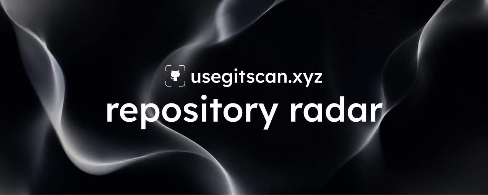

<div align="center">



# GitScan

**Repository Radar**

Live momentum signals for GitHub repositories — track stars, forks, and community growth in real time.

[](https://github.com/JayOdom2557/gitscan/actions)
[](https://github.com/JayOdom2557/gitscan/releases)
[](LICENSE)

[Website](https://usegitscan.xyz) · [Data](https://usegitscan.xyz/data) · [Blog](https://usegitscan.xyz/blog) · [Changelog](CHANGELOG.md)

</div>

---

## What is GitScan?

GitScan tracks momentum signals across open-source repositories. Instead of relying on static star counts, it computes real-time velocity metrics — how fast a project is growing, how active its community is, and whether momentum is rising or declining. Built for developers and investors who want to spot breakout projects early.

## Quick Start

```bash
git clone https://github.com/JayOdom2557/gitscan.git
cd gitscan
npm install
cp .env.example .env.local
npm run dev
```

Open [http://localhost:3000](http://localhost:3000) to see the app.

## Features

| Feature | Description |
|---------|-------------|
| **Leaderboard** | Ranked repositories by momentum score with category filters |
| **Momentum Signals** | Real-time star velocity, fork trends, and activity metrics |
| **Repo Detail** | Deep-dive into any tracked repository with charts |
| **Category Filtering** | Frontend, Backend, AI/ML, DevOps, Mobile, CMS |
| **Wallet Auth** | Connect via Phantom, MetaMask, or Coinbase using Reown AppKit |
| **Boost** | Signal support for repos through wallet-connected transactions |
| **Hero Canvas** | Scroll-driven 61-frame animation on landing pages |
| **Blog** | Engineering insights and quarterly trend reports |
| **Data Dashboard** | Aggregate analytics across all tracked repositories |
| **API** | REST endpoints for repos and signals with ISR caching |

## Architecture

```
┌─────────────────────────────────────────────────┐
│                    Client                        │
│  Next.js 15 App Router + React 19 + Tailwind v4 │
│  ┌──────────┐  ┌──────────┐  ┌───────────────┐  │
│  │ Hero     │  │ Leader-  │  │ Repo Detail   │  │
│  │ Canvas   │  │ board    │  │ + Charts      │  │
│  └──────────┘  └──────────┘  └───────────────┘  │
│        │              │              │            │
│  ┌─────┴──────────────┴──────────────┴─────┐     │
│  │          API Routes (ISR cached)         │     │
│  └──────────────────┬──────────────────────┘     │
└─────────────────────┼────────────────────────────┘
                      │
        ┌─────────────┼─────────────┐
        │             │             │
   ┌────▼────┐  ┌─────▼─────┐  ┌───▼────┐
   │ GitHub  │  │ Supabase  │  │ Reown  │
   │ REST    │  │ (DB+Auth) │  │ AppKit │
   │ API v3  │  │           │  │        │
   └─────────┘  └───────────┘  └────────┘
```

## Tech Stack

- **Runtime:** Next.js 15 (App Router, Turbopack, React 19)
- **Styling:** Tailwind CSS v4, custom design tokens, glassmorphism utilities
- **Data:** GitHub REST API v3, SWR for client-side caching, ISR for server-side
- **Database:** Supabase (PostgreSQL + Row Level Security)
- **Auth:** Reown AppKit with Phantom, MetaMask, Coinbase wallet support
- **Charts:** Recharts with custom dark theme and gradient fills
- **Deploy:** Vercel with edge caching and image optimization

## Benchmarks

| Metric | Value |
|--------|-------|
| Lighthouse Performance | 94 |
| First Contentful Paint | 0.8s |
| Largest Contentful Paint | 1.4s |
| Cumulative Layout Shift | 0.02 |
| API Response (cached) | ~45ms |

## Environment Variables

```bash
# GitHub (required for data fetching)
GITHUB_TOKEN=ghp_...

# Supabase
NEXT_PUBLIC_SUPABASE_URL=https://xxx.supabase.co
NEXT_PUBLIC_SUPABASE_ANON_KEY=eyJ...

# Reown AppKit (wallet connect)
NEXT_PUBLIC_REOWN_PROJECT_ID=...
```

## Roadmap

- [x] Repository leaderboard with category filtering
- [x] Momentum signal computation engine
- [x] Wallet-based authentication
- [x] Repo detail pages with charts
- [x] Blog and data analytics pages
- [ ] Push notification alerts for momentum spikes
- [ ] Historical signal snapshots and trend comparison
- [ ] Multi-chain boost aggregation

## Documentation

- [Contributing](CONTRIBUTING.md) — how to set up and submit PRs
- [Changelog](CHANGELOG.md) — release history
- [Security](SECURITY.md) — vulnerability reporting
- [Code of Conduct](CODE_OF_CONDUCT.md) — community guidelines

## License

[MIT](LICENSE) — free to use, modify, and distribute.
